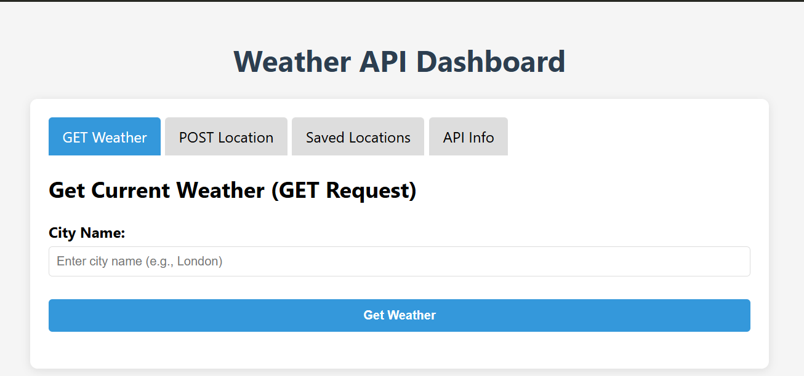
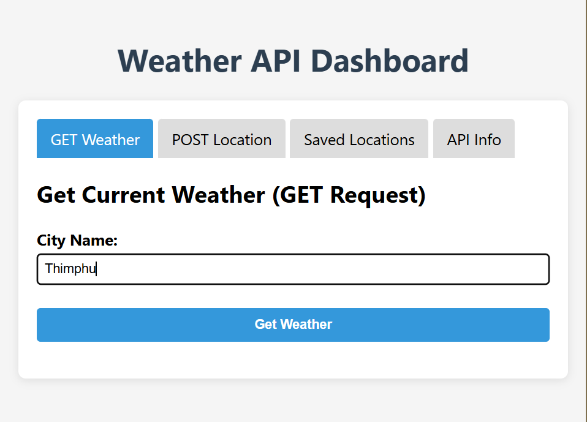
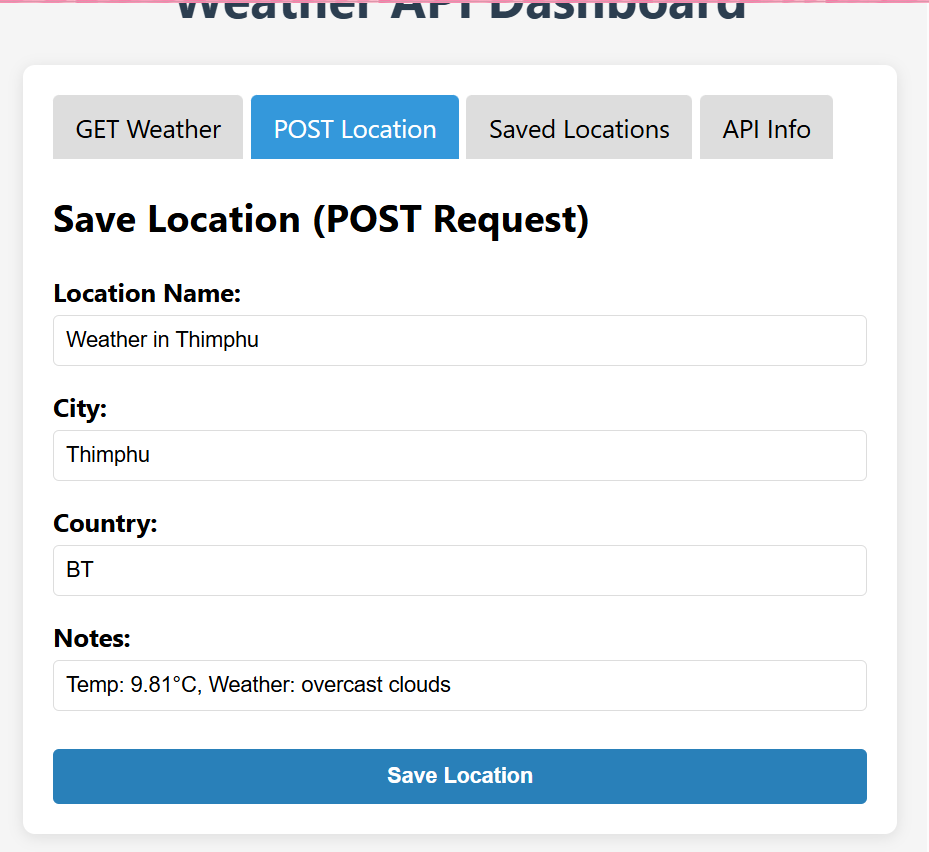

# Weather API Dashboard

A simple weather application that allows users to check current weather conditions and manage saved locations using REST API operations (GET, POST, PUT, DELETE).

## Project Overview

This project demonstrates the implementation of HTTP requests to interact with the OpenWeatherMap API. Users can retrieve weather data for any city, save their favourite locations, and perform basic CRUD operations on their saved list.

## Files

| File         | Purpose                                                    |
| ------------ | ---------------------------------------------------------- |
| `index.html` | The main webpage and user interface                        |
| `script.js`  | JavaScript code handling API requests and DOM manipulation |

## Setup Instructions

### Step 1 – Obtain an API Key

1. Visit https://openweathermap.org/
2. Create a free account
3. Navigate to the API keys section
4. Copy your default API key

### Step 2 – Configure the Application

1. Open `script.js` in your text editor
2. Locate this line:

```javascript
const WEATHER_API_KEY = "API Key"; 
```

3. Replace `'API Key'` with your actual OpenWeatherMap API key
4. Save the file

### Step 3 – Launch the Application

1. Open `index.html` in your web browser
2. The application should load and be ready to use

## How to Use the Application

### GET Weather Data

1. Enter a city name in the search field
2. Optionally, add a two-letter country code (e.g., US, GB, JP)
3. Click the "Get Weather" button
4. Current weather information will display, including:
   - Temperature
   - Weather condition
   - Humidity
   - Wind speed

### POST (Save Location)

1. Fill out the "Save Location" form with:
   - City name
   - Country code
   - Any additional notes
2. Click the "Save Location" button
3. The location will appear in the "Saved Locations" list

### PUT (Update Location)

1. In the "Saved Locations" section, click the "Edit" button on any saved location
2. Modify the location details in the form
3. Click "Update" to save changes
4. The location entry will be updated in the list

### DELETE (Remove Location)

1. In the "Saved Locations" section, click the "Delete" button
2. The location will be removed from the saved list

## Important Notes

- New API keys may take up to one hour to activate. If requests fail initially, wait and try again.
- Saved locations are stored temporarily and will reset when the page is refreshed.
- For best results, use two-letter ISO country codes (US, GB, JP, etc.)
- The application requires an active internet connection to fetch weather data.

## API Endpoints Used

| Operation        | Endpoint                       | HTTP Method |
| ---------------- | ------------------------------ | ----------- |
| Get weather data | OpenWeatherMap Current Weather | GET         |
| Save location    | Local storage simulation       | POST        |
| Update location  | Local storage simulation       | PUT         |
| Delete location  | Local storage simulation       | DELETE      |

## Sample Output

**Main Dashboard:**


**GET Request – Weather Data:**


**POST Request – Save Location Form:**


**Saved Locations List:**


**PUT Request – Edit Location:**


**API Information Display:**


## Troubleshooting

| Issue                | Solution                                                                    |
| -------------------- | --------------------------------------------------------------------------- |
| API requests failing | Verify your API key is valid and has been activated (may take up to 1 hour) |
| City not found       | Check spelling and use correct country code format                          |
| Data not persisting  | Note that saved data resets on page refresh as it uses temporary storage    |
| CORS errors          | Ensure you are using the correct OpenWeatherMap API endpoint                |

## Technologies Used

- HTML5 for page structure
- CSS for styling and layout
- JavaScript for API requests and DOM manipulation
- OpenWeatherMap API for weather data

## Learning Outcomes

By completing this project, I have learned:

- How to make HTTP GET requests to retrieve data from an external API
- How to implement POST requests to simulate saving data
- How to implement PUT requests to update existing data
- How to implement DELETE requests to remove data
- How to handle API responses and errors in JavaScript
- How to manage user input and validation
- How to dynamically update the DOM based on API responses

---

**Created:** May 2026  
**Course:** WEB101 - Web Development Practicals  
**Practical Number:** Practical 2
